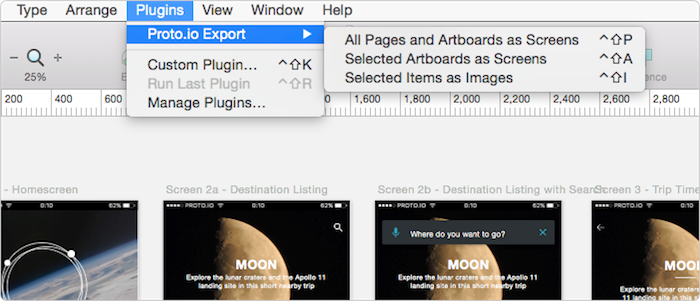
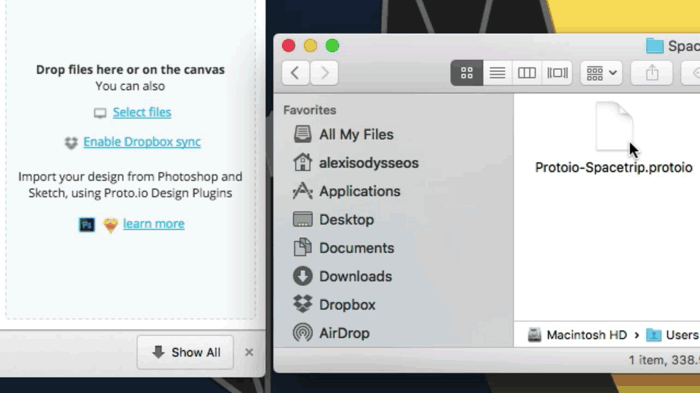

Export to Proto.io
=====================
# Installation
1. [Download Zip](https://dteyv52hbg2at.cloudfront.net/tools/sketch/Protoio-sketch-plugin.zip) or clone the repository
2. Double click `Export to Proto.io.sketchplugin` to install

# How it works
1. Select one of the options under `Plugins > Proto.io`

* All Pages and Artboards as Screens
* Selected Artboards as Screens
* Selected Items as Images

2. Drag and drop exported file in Proto.io

[Watch video tutorial](https://vimeo.com/145843990)

# Licence
BSD-2
